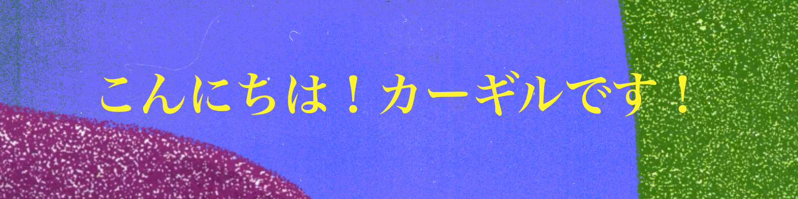
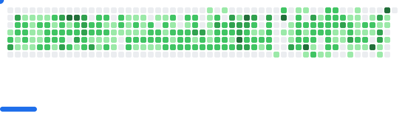

  

#### 🔍 概要

まず動かして全体像を掴み、そこから改善を重ねていく。試行錯誤を通じて、実践的な課題解決を学ぶことが好きです。

#### 💡 ちょっとした情報

| **属性**                             | **値**                          |
| :---                                | :---                               |
| *使用言語*                            | `英語` (ネイティブ), `ジャマイカ・クレオール語` (ネイティブ), `日本語` (n2)|
| *プログラミング*                       | `python`, `java`, `ruby`, `javascript`           |
| *GitHub登録*                         | `7年前`      |
| *リポジトリ数*                        | `41`               |
| *コミット数*                          | `5003`                    |
| *趣味*                               | `音楽`, `ポッドキャスト`, `読書` ([Goodreads](https://www.goodreads.com/user/show/190731384-cargill-seiveright)), `ハイキング`, `スキー`, `温泉`|
| *linkedin* | [`cargill seiveright`](https://www.linkedin.com/in/cargill-s-a074b3125/)|

<picture>
  <source
    media="(prefers-color-scheme: dark)"
    srcset="assets/img/breakout-dark.svg"
  />
  <source
    media="(prefers-color-scheme: light)"
    srcset="assets/img/breakout-light.svg"
  />
  
</picture>
