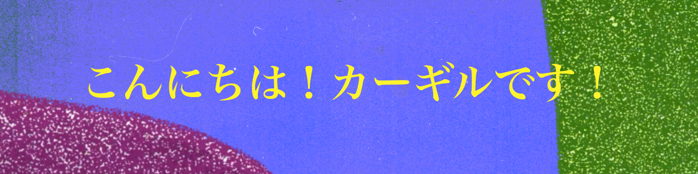

  

#### 🔍 概要

まず動かして全体像を掴み、そこから改善を重ねていく。試行錯誤を通じて、実践的な課題解決を学ぶことが好きです。

#### 💡 ちょっとした情報

| **属性**                             | **値**                          |
| :---                                | :---                               |
| *使用言語*                            | `英語` (ネイティブ), `ジャマイカ・クレオール語` (ネイティブ), `日本語` (n2)|
| *プログラミング*                       | `ruby`, `python`, `java`, `javascript`, `sql`    |
| *フレームワーク*                       | `ruby on rails`, `angularjs`, `react`, `flask`, `next.js` |
| *GitHub登録*                         | `7年前`      |
| *リポジトリ数*                        | `47`               |
| *コミット数*                          | `5559`                    |
| *趣味*                               | `音楽`, `ポッドキャスト`, `読書` ([Goodreads](https://www.goodreads.com/user/show/190731384-cargill-seiveright)), `ハイキング`, `スキー`, `温泉`|
| *linkedin* | [`cargill seiveright`](https://www.linkedin.com/in/cargill-s-a074b3125/)|
| *exercism* | [`gill876`](https://exercism.org/profiles/gill876)|

#### 🛠️ 技術スタック

  

#### 📊 GitHub統計

  <picture>
    <source media="(prefers-color-scheme: dark)" srcset="https://github-readme-stats.vercel.app/api?username=gill876&show_icons=true&theme=dark&hide_border=true" />
    <source media="(prefers-color-scheme: light)" srcset="https://github-readme-stats.vercel.app/api?username=gill876&show_icons=true&theme=default&hide_border=true" />
    
  </picture>
  <picture>
    <source media="(prefers-color-scheme: dark)" srcset="https://github-readme-stats.vercel.app/api/top-langs/?username=gill876&layout=compact&theme=dark&hide_border=true" />
    <source media="(prefers-color-scheme: light)" srcset="https://github-readme-stats.vercel.app/api/top-langs/?username=gill876&layout=compact&theme=default&hide_border=true" />
    
  </picture>

<picture>
  <source
    media="(prefers-color-scheme: dark)"
    srcset="assets/img/breakout-dark.svg"
  />
  <source
    media="(prefers-color-scheme: light)"
    srcset="assets/img/breakout-light.svg"
  />
  
</picture>
