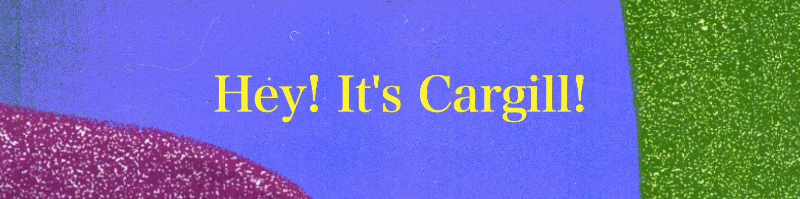
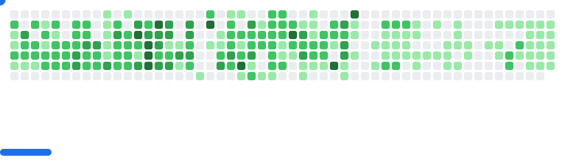

  

#### 🔍 Overview

I like getting things to work first, then making them better by learning through iteration and real-world problem solving.

#### 💡 Fun Facts

| **Attribute**                       | **Value**                          |
| :---                                | :---                               |
| *languages*                         | `english` (native), `jamaican creole` (native), `japanese` (n2)|
| *programming*                       | `ruby`, `python`, `java`, `javascript`, `sql`    |
| *frameworks*                        | `ruby on rails`, `angularjs`, `react`, `flask`, `next.js` |
| *github registration*               | `7 years ago`      |
| *repositories*                      | `47`               |
| *commits*                      | `5558`                    |
| *hobbies*                             | `music`, `podcast`, `reading` ([Goodreads](https://www.goodreads.com/user/show/190731384-cargill-seiveright)), `hiking`, `skiing`, `onsen`|
| *linkedin* | [`cargill seiveright`](https://www.linkedin.com/in/cargill-s-a074b3125/)|
| *exercism* | [`gill876`](https://exercism.org/profiles/gill876)|

#### 🛠️ Tech Stack

  

#### 📊 GitHub Stats

  <picture>
    <source media="(prefers-color-scheme: dark)" srcset="https://github-readme-stats.vercel.app/api?username=gill876&show_icons=true&theme=dark&hide_border=true" />
    <source media="(prefers-color-scheme: light)" srcset="https://github-readme-stats.vercel.app/api?username=gill876&show_icons=true&theme=default&hide_border=true" />
    
  </picture>
  <picture>
    <source media="(prefers-color-scheme: dark)" srcset="https://github-readme-stats.vercel.app/api/top-langs/?username=gill876&layout=compact&theme=dark&hide_border=true" />
    <source media="(prefers-color-scheme: light)" srcset="https://github-readme-stats.vercel.app/api/top-langs/?username=gill876&layout=compact&theme=default&hide_border=true" />
    
  </picture>

<picture>
  <source
    media="(prefers-color-scheme: dark)"
    srcset="assets/img/breakout-dark.svg"
  />
  <source
    media="(prefers-color-scheme: light)"
    srcset="assets/img/breakout-light.svg"
  />
  
</picture>

<!--
**gill876/gill876** is a ✨ _special_ ✨ repository because its `README.md` (this file) appears on your GitHub profile.

Here are some ideas to get you started:

- 🔭 I’m currently working on ...
- 🌱 I’m currently learning ...
- 👯 I’m looking to collaborate on ...
- 🤔 I’m looking for help with ...
- 💬 Ask me about ...
- 📫 How to reach me: ...
- 😄 Pronouns: ...
- ⚡ Fun fact: ...

Inspiration:
https://github.com/paulrsmithjnr/paulrsmithjnr
https://github.com/orhun/orhun
https://github.com/Thaiane/Thaiane
https://github.com/cyprieng/github-breakout
-->
