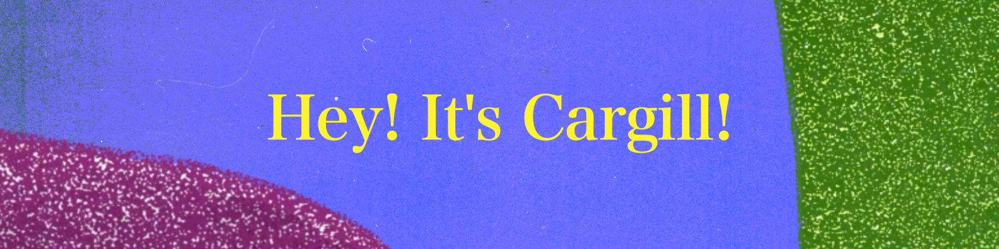

  

#### 🔍 Overview

I like getting things to work first, then making them better by learning through iteration and real-world problem solving.

#### 💡 Fun Facts

| **Attribute**                       | **Value**                          |
| :---                                | :---                               |
| *languages*                         | `english` (native), `jamaican creole` (native), `japanese` (n2)|
| *programming*                       | `python`, `java`, `ruby`, `javascript`           |
| *github registration*               | `{{ ACCOUNT_AGE }} years ago`      |
| *repositories*                      | `{{ REPOSITORIES }}`               |
| *commits*                      | `{{ COMMITS }}`                    |
| *hobbies*                             | `music`, `podcast`, `reading` ([Goodreads](https://www.goodreads.com/user/show/190731384-cargill-seiveright)), `hiking`, `skiing`, `onsen`|
| *linkedin* | [`cargill seiveright`](https://www.linkedin.com/in/cargill-s-a074b3125/)|

<!--
**gill876/gill876** is a ✨ _special_ ✨ repository because its `README.md` (this file) appears on your GitHub profile.

Here are some ideas to get you started:

- 🔭 I’m currently working on ...
- 🌱 I’m currently learning ...
- 👯 I’m looking to collaborate on ...
- 🤔 I’m looking for help with ...
- 💬 Ask me about ...
- 📫 How to reach me: ...
- 😄 Pronouns: ...
- ⚡ Fun fact: ...

Inspiration:
https://github.com/paulrsmithjnr/paulrsmithjnr
https://github.com/orhun/orhun
https://github.com/Thaiane/Thaiane
-->
